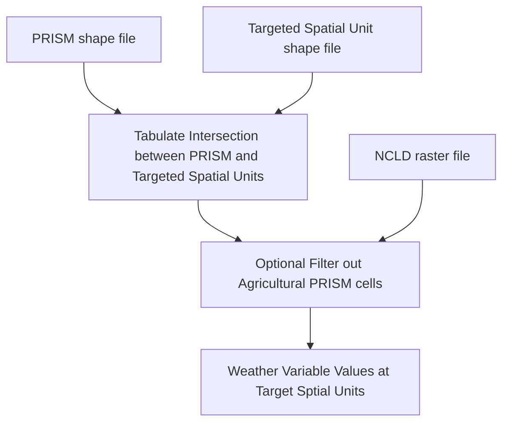

# prismTabulation
This repository is about tabulate several weather variables by various spatial units, like county, HUC8/12 based on PRISM data set. Different from the https://github.com/bryanparthum/prism_weather_data, this repository provides a set of R scripts to tabulate weather variables from PRISM by first downloading corresponding raster files from Oregon PRISM FTP (prism.nacse.org) site and subsequently handling the data tabulation. 

At the same, this repository emphasizes the focus of agriculture related weather tabulation. Specifically, the PRISM cells included in the final tabulation need to have some cropland identified in National Land Cover Database (NLCD). The aggregation scheme is the area-weighted method. For example, if a county $i$ overlaps with a set of PRISM cells $j=1,\ldots,J$, the aggregated average of weather variable $w$ is
$$w_i = \frac{1}{A_i}\sum^J_{j=1}（a_{ij}*w_j）$$
where $A_i$ is the sum of all $a_{ij}$, $w_j$ is the value of w in PRISM cell $j$.

Since the PRISM cells are fixed in the sense that all raster files have the same spatial extent and the same spatial resolution, we could prepare a shapefile with each PRISM cell represented by one polygon cell. With this shape file, we can use the Tabulate Intersection function in ArcGIS Analysis Tools/Statistics to get the overlapped cells for the targeted spatial units. This intersection information could also be obtained via other softwares. 

Technical Flowchart

  
Data Sources 
1. PRISM data set (http://www.prism.oregonstate.edu/) 
2. County Maps
3. HUC8/10/12 Maps 
3. National Land Cover Database (NLCD)  

Data Files
1. prism.shp - PRISM raster cell shape file. Since PRISM has only the same extent and spatial resolution, you can use this shape file directly. Cell identifier variable： 
2. cb_2020_us_county_5m.shp - county shape file downloaded from https://www2.census.gov/geo/tiger/GENZ2020/shp/ 
3. wbdhuc8.shp, wbdhuc10, wbdhuc12.shp - converted from polygon feature from USGS HUC https://prd-tnm.s3.amazonaws.com/index.html?prefix=StagedProducts/Hydrography/WBD/National/GDB/
The huc shape files are not included due to the large size. Another observation is that there is a size limit of 2GB for .shp file, so it is better to work with feature class in a gdb. 
4. cb_2020_us_county_prism.csv - county intersection file with PRISM cells 
5. huc8_prism.csv - HUC8 intersection file with PRISM cells 
6. huc12_prism.csv - HUC12 intersection file with PRISM cells 
7. prism_nlcd2001.csv - Cropland filter based on NCLD2001
8. prism_nlcd2004.csv - Cropland filter based on NCLD2004
9. prism_nlcd2006.csv - Cropland filter based on NCLD2006
10. prism_nlcd2008.csv - Cropland filter based on NCLD2008
11. prism_nlcd2011.csv - Cropland filter based on NCLD2011
12. prism_nlcd2014.csv - Cropland filter based on NCLD2013
13. prism_nlcd2016.csv - Cropland filter based on NCLD2016
14. prism_nlcd2019.csv - Cropland filter based on NCLD2019

R scripts 
1. tabulateDaily.r with (prismfold,weather variables, spatialid,intersection files, filter files, timewindow), 
prismfold: directory where you saved the downloaded PRISM files.The file structure is weathervariable / year / daily raster zip files 
weather variables:  like c('ppt','tmax') or c('ppt','tdmean','tmax','tmean','tmin','vpdmin','vpdmax') 
spatialid: the variable name used to identify spatial unit, like 'huc8','huc12','geoid'.  
intersection files:  prepared intersection files or your file, remember the PRISM cell indentifier is names as pid, targeted spatial unit identifier is names as sid. and overlapping area variable is named as area (unit of area is not important since only shares matter).
filter files: none, no filter file, otherwise, using one of the pre-prepared filter file. Name PRISM cell identifier as pid, filter variable as flag (1: included, 0: excluded).
time windown: array of years, like c(1981:2010), c(2020:2020) 

Some Used Arcpy functions
1. arcpy.analysis.TabulateIntersection() : tabulate intersected areas 
2. arcpy.sa.TabulateArea(): tabulate raster values https://pro.arcgis.com/en/pro-app/latest/tool-reference/spatial-analyst/tabulate-area.htm
3. arcpy.conversion.TableToTable(): convert arcgis table to csv table  

